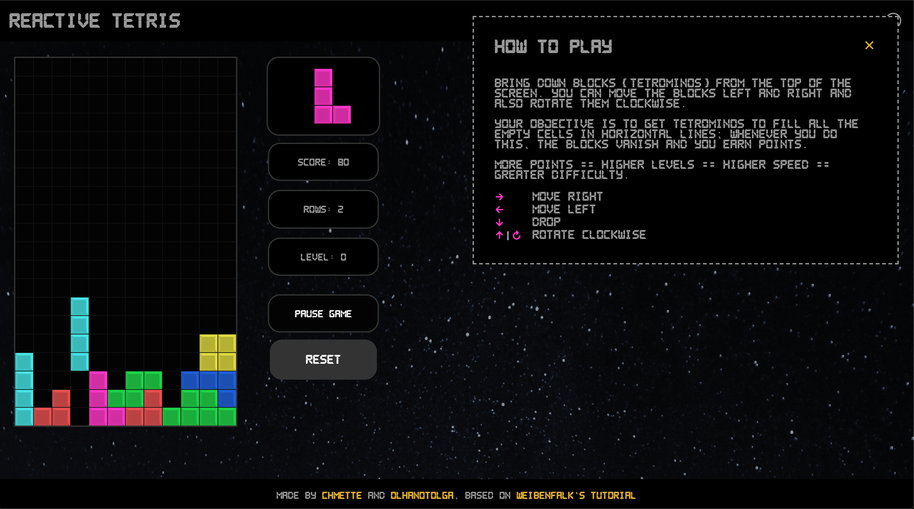
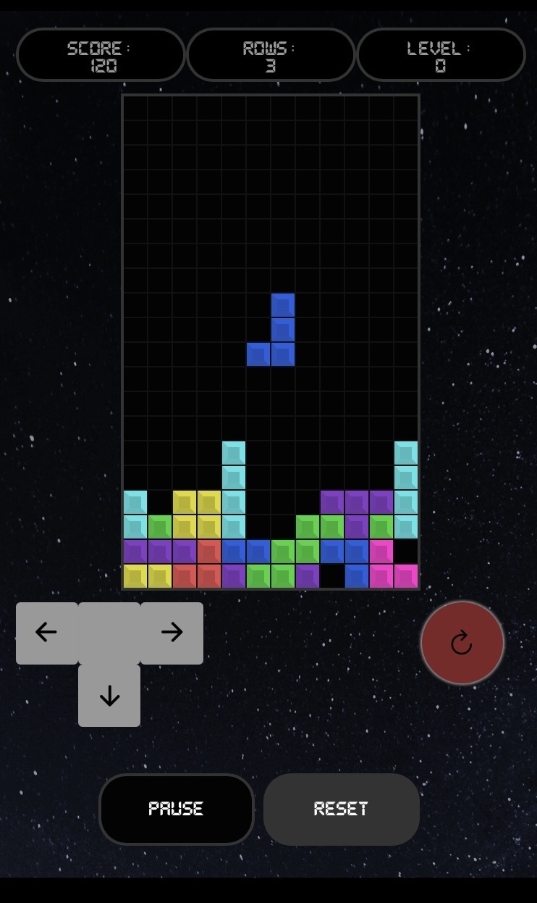
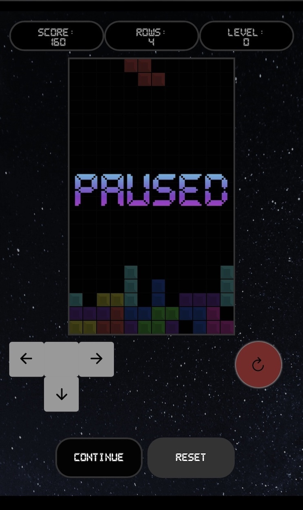

# Reactive Tetris

See it live [on Netlify](https://reactive-tetris.netlify.app)

## About

A final project for the React module at DCI by [chmette](https://github.com/chmette) and [olhanotolga](https://github.com/olhanotolga)

We wanted to make something interactive and challenging, that's how we came across games in general, and Tetris is a classic one!

### About the Game

Tetris is a puzzle tile-matching Computer Game from 1984 (with origins in the USSR).

#### How to play

The player needs to position the blocks (tetrominos) which come from the top of the screen. The player can move the blocks left and right and also rotate them clockwise. The objective is to get tetrominos to fill all the empty cells in horizontal lines; whenever this is done, the blocks vanish and the player earns points. More points == higher levels == higher speed == greater difficulty.

---

## Project Description

This project was bootstrapped with [Create React App](https://github.com/facebook/create-react-app).

The tech stack:

- React (with hooks)
- styled components
- react-icons
- react-responsive

### Screenshots

 

---

## Features

-Stage and tetrominos
-Key controls, rotation
-Collision checking
-Row sweeping
-Droping & speeding up the tetro with intervals
-Score count, levels

-Mobile Controls,
-Pausing
-Overlays: Pause,GameOver,StartGame
-Coming next tetromino stage

---

## Learnings

Game logic (the notions of player and stage, their interaction)
making something this visual
the use of a CSS in JS library (styled components)
extended use of custom hooks
making react apps responsive on mobile (adapting UI to device/screen)

---

## Cloning and using locally

1. Clone the repo locally: `git clone git@github.com:chmette/reactive-tetris.git`
2. go to the project folder: `cd reactive-tetris`
3. install the dependencies with `npm install`
4. run `npm start` to view the project on your local host

---

## Credits

Thanks to Thomas Weibenfalk whose [amazing tutorial](https://youtu.be/ZGOaCxX8HIU) served as the base for this project
He has more awesome Projects on [his GitHub Page](https://github.com/weibenfalk)
